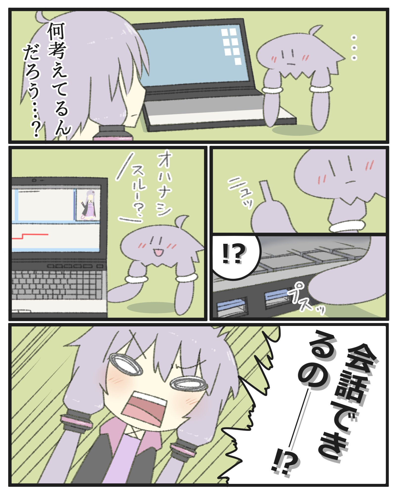

# ゆかクラッチ 取り扱いマニュアル  

常に最新版を確認してください．  
[https://github.com/wallstudio/VoishoEmbedded2/blob/master/Misc/Manual.md](https://github.com/wallstudio/VoishoEmbedded2/blob/master/Misc/Manual.md)  
  


* 製作者情報  
    うｐﾊｼ （WallStudio）   
    Twitter [@yukawallstudio](https://twitter.com/yukawallstudio)  
    メール [yukawallstudio＠gmail.com](mailto:yukawallstudio＠gmail.com) 

* 権利表記    
      
    &copy;2017 WallStudio  
    私的利用の範囲を逸脱した利用を禁じます．  
    「弦巻マキ」および「結月ゆかり」は株式会社AHSのキャラクターです．  
    ゆかクラッチは申請名「VoishoEmbedded2」としてこの作品は株式会社AHSにて許諾を受けています．  
    「ゆかクラゲ」は [@BOSS\_CAU](https://twitter.com/BOSS_CAU) 氏による結月ゆかりの二次創作作品です．  
    「ゆかクラゲ」二次利用は [@BOSS\_CAU](https://twitter.com/BOSS_CAU) 氏に許諾を受けています．

    プログラムについて  
    copyright (c) 2017 WallStudio   
    Released under the GPL license  
    https://www.gnu.org/licenses/gpl.html

    また以下の公開されたコードを含みます．

    [blkcatman/VoiceroidTalker  
    copyright (c) 2015 Tatsuro Matsubara](https://github.com/blkcatman/VoiceroidTalker)  
    Released under the MIT license  
    http://opensource.org/licenses/mit-license.php

    [Keyboard_jp.h](http://mgt.blog.so-net.ne.jp/2016-01-14)  
    Copyright (c) 2015, Arduino LLC  
    Original code (pre-library): Copyright (c) 2011, Peter Barrett Modified for Japanese 106/109 Keyboard by Toshiyuki UENO MMXVI This library is free software; you can redistribute it y it under the terms of the GNU Lesser General Public License as published by the Free Software Foundation; either version 2.1 of the License, or (at your option) any later version.  
    This library is distributed in the hope that it will be useful, but WITHOUT ANY WARRANTY; without even the implied warranty of MERCHANTABILITY or FITNESS FOR A PARTICULAR PURPOSE.  See the GNU Lesser General Public License for more details.   
    You should have received a copy of the GNU Lesser General Public License along with this library; if not, write to the Free Software Foundation, Inc., 51 Franklin St, Fifth Floor, Boston, MA  02110-1301  USA    


## 目次  
1. ゆかクラッチとは？
2. 注意事項
3. 使い方
4. PCとの接続 new!
5. 育て方
6. 免責事項
7. （アップデート）
## 1. ゆかクラッチとは？  
ゆかクラッチとはVOICEROID結月ゆかりの派生キャラクター「**ゆかクラゲ**」をモチーフにしたグッズです．  
液晶パネルとコンピューターを搭載し，ゆかクラゲの育成が楽しめることを目標に作られました．前作のけだまっちの機能に加え様々な追加がされています．

## 2. 注意事項  
* 工業製品の安全基準を満たしたものではありません．使用する際には**ご自身で十分に安全なことを確認**の上お使いください．
* 安全管理の難しいお**子様には与えないで**ください．
* 棘やバリが残っている箇所があります．また，内部は電子回路がむき出しの為電池交換の際は十分に注意をはらってください．
* 致死レベルではありませんが，高めの電圧を扱っていますので感電に注意してください．触れた手で触れることがないようにしてください．
* 50度くらいで筐体が柔らかくなり始めます．**高温下で保管しない**でください．また，発熱を始めたら使用を中止してください．
* 部品の特性で機械自体の寿命があります．理論上は数年～数十年持ちますが，状態・環境によっては数か月に縮むかもしれません．
* PCをハッキング（したように見える）機能があります．（これはゆかクラゲの公式設定です）実際にPCの操作権限を無制限に奪取することや，人間やデータに害を成す機能は搭載されていません．しかしながら意図せぬバグや環境によっては正しく動かないばあいや変更を加えてしまう可能性がありますので重要なデータのバックアップなどは怠らないようにしてください．  
  

## 3．使い方  
### 初めての起動
1. 背面のカバーをスライドして開けます．爪を入れ少し浮かせるようにしてスライドさせると簡単に外れます  


1. 乾電池の端子についた絶縁体を取り除きます．

1. 背面のカバーを閉じます．

1. 正面のボタンのいずれかを長押し（～10秒）してください．

1. HOME画面が表示されます．
### SLEEPモード
1. HOME画面で右ボタンをおすとSLEEPモードになります．この状態にしておくこと電池の持ちが少しよくなります．この間も内部の時間は進み続けますが，成長イベントの通知はないので注意が必要です．

1.  正面のボタンのいずれかを長押し（～10秒）するとSLEEPモードから復帰します．

### バックライト
ゆかクラッチは青色のバックライトを搭載しています．「MENUE → ｾｯﾃｲ → LIGHT」でON/OFFが出来ます．
### 電池交換
1. 使用する乾電池は 6LR61 または 6F22です．これはコンビニや100円ショップでも売られている四角い9Vのものです．（6V以上の電圧が得られるようにしてください）

1. 背面のカバーを開けます．

1. 入っている電池をコネクタの端子部分をつまんで外します．

1. 正極負極を確認して新しい電池を接続します．

1. 背面のカバーを閉じます．

### 外部電源
USBから電源を取ることが出来ます．端子はMini USBです．これは一般的なスマートフォンの端子（Micro USB）とは互換性が無いので注意してください．Mini USBケーブルは家電量販店や100円ショップでも手に入ります．  
EX版は足をけだマキバッテリーに挿すことでも給電できます．  
※乾電池がつながっているときは乾電池を外して繋げてください．  
### 操作
ボタンは3つあり，画面の下部に対応した位置にそれぞれのボタンの意味が表示されます．（例: HOME画面では，右ボタンがSLEEP，中央ボタンがMENUE，左ボタンは無効になっています）

## 4. PCとの接続
ゆかクラゲは足先をUSB端子の形に変形し，PCに差し込むことでPCを操作し会話するする能力を有しています．（公式設定）

>    
> [@BOSS_CAU ツイートより引用](https://twitter.com/boss_cau/status/885141780349411328)  

ゆかクラッチではこの能力を忠実に再現し，本体にぶら下がる足を Windows PC に挿すことで，PCを介したコミュニケーションが可能です．もちろんゆかりさんがインストールされているPCでは**ゆかりさんの声**でしゃべります．
### 動作確認済み環境
* OS: Windows 10 ※1
* CPU: x86またはAMD64アーキテクチャ ※2
* メモリ: 2GB以上
* 画面: HD以上
* （VOICEROID+結月ゆかりEX ※3）
* インターネット必須

    ※1 確認はできていませんが，Windows7の最新版以上なら動くと思います．  
    ※2 いわゆる普通のPCです．タブレットなどの一部はこれではないことがあります．  
    ※3 なくても動きますが，音は出ません． 
### ゆかクラッチEXの場合
USBポートに挿して1～2分ほどキーボードやマウスを触らずに放置してください．  
ゆかクラゲがデスクトップに出現した起動完了です．会話を楽しんでください．

### ゆかクラッチ（無印）の場合
```DetectYukaKurageDevice.exe``` をインストールしてからUSBポートに挿してください．インストールは```DetectYukaKurageDevice.zip```内の ```インストール.bat``` を実行するか，一度ゆかクラッチの中の ```インストール.bat``` を実行してください．  
その後，ゆかクラッチが接続されていない状態から挿し込むと「ゆかクラッチ」を検出しましたと表示されるので，1～2分ほど放置してください．  
ゆかクラゲがデスクトップに出現した起動完了です．会話を楽しんでください．

### うまくいかない場合
1. ウイルス対策ソフトによってさえぎられている可能性があります．これはウイルス対策ソフトを切ってしまえば解決しますが，十分に注意してください．
2. 自動再生機能に割り込まれている可能性があります．Windowsの設定から自動実行/自動再生を切って再挑戦してください．
3. それでもダメな場合，[@yukawallstudio](https://twitter.com/yukawallstudio)または [yukawallstudio＠gmail.com](mailto:yukawallstudio＠gmail.com) までお問合せください．（解決できる保証はありませんので悪しからず）  
4. ゆかクラゲッチのメモリ内にいくつかの ```.log``` ファイルにエラーメッセージなどが記録されています．役に立つかも…（上級者向け）
    
## 5. 育て方  
初めて電源を入れた際，ゆかクラゲはまだ幼体でイソギンチャクのような見た目をしています．（クラゲの幼体はこんな感じらしい）地道に育てていくことで立派なゆかクラゲへと成長していきます．  
### 体力
HOME画面の左上に表示される「✙」が残り体力です．最大3で世話を怠ると減っていき0になると死んでしまいます．減ってしまった体力は世話を焼き良好な状態を保つことで自動回復します．
  
### 好感度
HOME画面の右上に表示される「♥」が現在の好感度です．最大の3まで溜まると1段階成長します．また，成長直後は0にリセットされます．成長は2段階です．  
世話を焼き良好な状態を保つと好感度は上昇し，病気・空腹・汚れを放置すると減少します．
### 新陳代謝
ゆかクラゲは生き物ですから，お腹がすいたり病気になることもあります．
* 空腹   
    時間経過で発生します．放置すると体力が減っていきます．  
    「MENUE → ｺﾞﾊﾝ」でごはんをあげると回復します．
    時間経過で発生します．  
* 汚れ    
    時間経過で発生します．  
    「MENUE → ｿｳｼﾞ」で落ちた毛を処分できます．
* 病気   
    空腹や汚れが溜まっていると発生します．体力が減り続けます．  
    「MENUE → ﾅﾃﾞﾙ」で手当てをし完全に治癒することができます．
### ミニゲーム  
* ゆかクラゲともぐら叩きゲームができます．強く叩くと可哀そうなので優しくタイミングよくボタンを押しましょう．
  
### ギャラリー  
ゆかクラゲの様々な姿を鑑賞することができます．
### 通信  
このバージョンでは無効になっています．
### 設定  
2つの設定項目とデータの初期化ができます．設定を変更した場合の動作確認が不十分であるため，設定を変更することは非推奨となっています．
* VOLUEM
現在この設定は無効になっています．
* LIGHT
バックライトのON/OFFを切り替えます．
* CLEAR
セーブデータを全て削除し，初期状態に戻します．
### チートモード
掃除中に3つのボタンすべてを同時押しし再起動するとチートモードになり成長が早くなります．セーブデータを消すと元に戻ります．また，イベント中に楽しんでいただけるようにチートモードONの状態でお渡しします．


## 6. 免責事項  
ゆかクラゲを購入・利用する際は**以下に同意**する必要があります．  

ゆかクラッチは十分な品質管理ができておりません．個体によってその品質が大きく異なります．**これは不良ではありません**．ソフトウェアの**パッチも原則作成しません**．お渡しする際の状態が全てです．

ゆかクラッチで怪我及びその他の損害を被った場合でも製作者が**補償することはできません**．  
ゆかクラッチそのものの**アフターサポートは基本的に行えません**．一応，ご連絡いただければお答えするかもしれませんが，これは必ずできるものではありません．

ゆかクラッチが故障した場合の修理は**無償・有償含め行えません**．設計書は公開（[https://github.com/wallstudio/VoishoEmbedded2 (Github)](https://github.com/wallstudio/VoishoEmbedded2)）されているので，ご自身で修理する助けになるかもしれません．

## 7. アップデート
<本体>  
基本的にアップデートによるサポートはありませんが，場合によってはアップデートを配信する可能性はあります．その際には以下の手順でPC経由によるアップデートを行うことが出来ます．（Windows10以降だとドライバが不要で楽です）
1. Arduino IDEのインストール  
PCで [https://www.arduino.cc/en/main/software](https://www.arduino.cc/en/main/software) よりArduino IDEをダウンロードします．（Arduinoに寄付をしない場合「Just download」を選べばダウンロードが始まります）
2. Arduino IDEのインストーラからインストールを実行します．  
 
3. Mini USBケーブルでPCとゆかクラッチをつなぎます．  
PCに認識されない場合，CH340ドライバをインストールしてください．
4. ソースコードのダウンロード  
[https://github.com/wallstudio/VoishoEmbedded](https://github.com/wallstudio/VoishoEmbedded) よりプロジェクトをダウンロードします．
 
5. 解凍し「VoishoEmbedded.ino」をArduino IDEで開きます．
6. 「ツール」 → 「ボード」で「Arduino Genuino/Uno」を選択，「ツール」 → 「シリアルポート」で新しく追加されたCOMポートを選択（普通COM1の外にもう一つCOMが現れるので，それを選んでください．）
 
 
7. コンパイルボタンを押します．  
 
8. 「スケッチのアップロードが完了しました」と表示されれば成功です．エラーが出る場合ここまでの手順を再確認してください．

<足>  
足の中にUSBフラッシュメモリが埋め込まれているので，アップデートのzipを展開し上書きしてください．